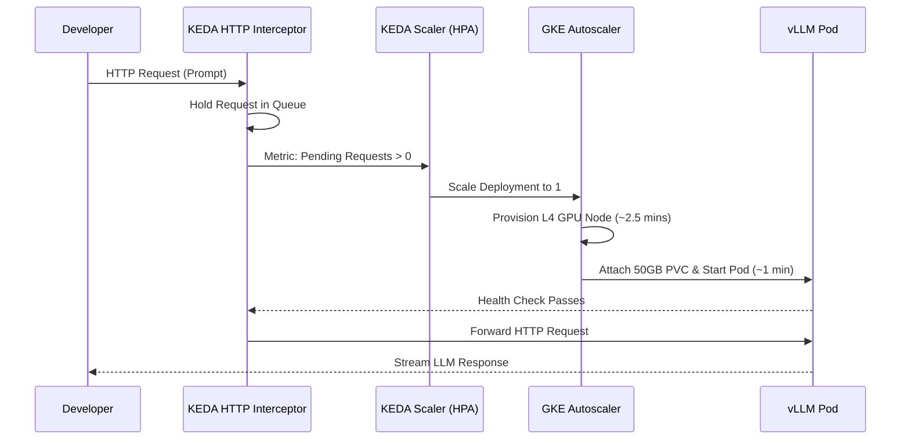

# vLLM on GKE Deployment


Welcome to the `vllm-gke` project! 

This repository contains the infrastructure as code (Terraform) and Kubernetes manifests to deploy a vLLM instance on Google Kubernetes Engine (GKE) with full scale-to-zero capabilities.

## Architecture Highlights
- **Model:** Qwen 2.5 Coder 14B AWQ.
- **Hardware:** GCP `g2-standard-8` (1x NVIDIA L4 GPU, 8 vCPUs, 32GB RAM) in `europe-west4-b`.
- **System Pool:** GCP `e2-standard-2` (dedicated to running KEDA and GKE system pods).
- **Security:** Strict security utilizing Workload Identity and private network.
- **Scale-to-Zero:** KEDA HTTP Add-on intercepts requests and scales the GPU node pool from 0 to 1, providing ~91% cost savings for idle periods.

### Scale-to-Zero Flow


## Cost Optimization (Zonal vs Regional)
To make this viable for a personal developer environment, this project utilizes a **Zonal Cluster** instead of a Regional one.
- **Regional Cluster:** Highly available across 3 zones. Costs ~$73/mo just for the management fee.
- **Zonal Cluster:** Lives in a single zone (e.g., `europe-west4-b`). Management fee is **$0/mo** (Free Tier).
Total idle cost drops from ~$800/mo (always-on enterprise) to **~$51.50/mo** (Zonal + KEDA).

## Security and Pre-commit Hooks

This project enforces strict security checks to prevent secrets from being leaked to the public repository. We use `pre-commit` to manage these hooks.

### Installation

1. Install the required security scanning binaries (macOS):
   ```bash
   brew install terraform-linters/tap/tflint
   brew install aquasecurity/trivy/trivy
   ```
2. Install [pre-commit](https://pre-commit.com/) (using `pip` or `uv`):
   ```bash
   uv pip install pre-commit
   ```
3. Install the hooks in this repository:
   ```bash
   pre-commit install
   pre-commit install --hook-type commit-msg
   ```

The pre-commit hooks will automatically check for:
- Accidentally committed secrets (`gitleaks`).
- Terraform misconfigurations and security issues (`trivy`, `tflint`).
- Correctly formatted commit messages (`conventional-commits`).

## Developer Guidelines
Before contributing, please review the `agent.md` file for project-specific instructions and security guidelines.
