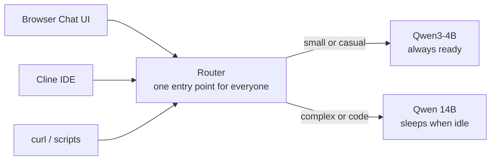

# Implementation Guide — How the Stack Works Today

This document explains, in plain language, what is actually deployed and how to
use it. Read this before the deeper design doc
(`semantic-routing-walkthrough.md`).

## The big picture

You have **one front door** for all LLM traffic. Every client — the browser chat
UI, Cline, a script with curl — sends its request to the same place. Behind the
door there are **two models**:

| Tier | Model | Runs on | Cost | Availability |
|---|---|---|---|---|
| CPU tier | Qwen3-4B (small) | The always-on cheap node | ~free (node runs anyway) | Instant, always ready |
| GPU tier | Qwen2.5-Coder-14B (big) | A GPU node that turns off when idle | ~$0.75/hour while awake | Sleeps when unused; waking takes 3-4 minutes |

The front door is the **semantic router**. Its only job is to look at each
request and decide which model should answer it.



## The three modes — available on every client

Every request carries a `model` field. That field is how the client picks a
mode. There are exactly three valid values:

| Mode | What you put in `model` | What happens |
|---|---|---|
| Force big model | `Qwen/Qwen2.5-Coder-14B-Instruct-AWQ` | Goes to the GPU. Always. If the GPU is asleep, the request waits while it wakes up. |
| Force small model | `qwen3-4b-cpu` | Goes to the CPU model. Always. Answers instantly, never touches the GPU. |
| Let the router decide | `auto` | The router reads your prompt and chooses. Casual chat → small model. Code or complex work → big model. When unsure, it chooses the big model. |

**All three modes work identically from Cline, from the chat UI, and from any
script.** There is no per-client restriction anywhere in the system. The `model`
field is the whole mechanism.

This was verified live on the cluster: forcing the big model answered with the
14B (after a wake), forcing the small model answered instantly with the 4B, and
`auto` sent casual prompts to the 4B and code prompts to the 14B.

## What happens when a request arrives

Say the chat UI sends "Tell me a fun fact about octopuses" with `model: auto`:

1. The request arrives at the router (through the Envoy gateway).
2. The router reads the prompt. It looks casual — no code, no technical task.
3. It labels the request for the small model and forwards it there.
4. The 4B answers in a second or two. The GPU never wakes up. Total cost: nothing.

Now say it sends "Refactor this function to use async/await" with `model: auto`:

1. Same door. The router reads the prompt — this is clearly code work.
2. It labels the request for the big model and forwards it toward the GPU.
3. If the GPU is asleep, the request is **held** (not failed) while the GPU node
   boots and the model loads — 3 to 4 minutes. The client just sees a slow request.
4. The 14B answers. After 5 minutes with no requests, the GPU goes back to sleep.

And if a client sends either prompt with a forced mode, steps 2-3 are skipped —
the router respects the choice without reading the prompt (0 ms overhead, this
is visible in its logs as `reason_code: model_specified`).

## How "auto" decides, and its safety rule

The router has a small built-in classifier (ModernBERT) that categorizes each
prompt. The rules we configured:

- Code and engineering topics, or code-ish keywords (refactor, debug, schema,
  sql, docker, function, api, ...) → **big model**
- Hard science/math topics → **big model**
- Casual topics (chat, history, cooking, travel, general knowledge) → **small model**
- Anything it can't confidently classify → **big model**

That last rule is deliberate and important. It's called **escalation bias**:
when in doubt, spend a little money. A casual question mistakenly sent to the
big model costs a GPU wake — a few cents and some waiting. A complex coding
question mistakenly sent to the small model produces an answer that looks fine
but is quietly wrong — which is much worse. So the system is tuned to waste
money rather than risk bad answers.

## Connecting clients

Both clients need two things: the address of the door, and the shared password.

**The door.** On your machine, run this once per session:
```bash
export ENVOY_SERVICE=$(kubectl get svc -n envoy-gateway-system \
  --selector=gateway.envoyproxy.io/owning-gateway-namespace=vllm,gateway.envoyproxy.io/owning-gateway-name=semantic-router \
  -o jsonpath='{.items[0].metadata.name}')
kubectl port-forward -n envoy-gateway-system svc/$ENVOY_SERVICE 8081:80
```
After this, the stack is reachable at `http://localhost:8081/v1`. Nothing is
exposed to the internet; only your machine can reach it, while this command runs.

**The password.** One API key protects both models. Cline and the UI send it as
a Bearer token. Without it every request gets a 401.

**Cline settings:** provider = OpenAI Compatible, base URL
`http://localhost:8081/v1`, API key = the shared key, model = one of the three
mode strings from the table above.

**Chat UI settings:** same URL, same key. A natural UI design is a dropdown with
three choices — "Big (14B)", "Small (4B)", "Auto" — that simply fills the
`model` field with the matching string.

## Practical advice per client (advice, not rules)

The system allows every mode on every client. Whether a mode is *useful*
depends on the client:

- **Chat UI → use `auto`.** Messages are independent and vary in complexity.
  This is exactly the case the router exists for.
- **Cline → keep it on the big model.** Cline is a coding agent: nearly every
  message it sends is code-related, so `auto` would choose the big model ~99%
  of the time anyway. Worse, Cline's conversation is a chain — plan, edit, run,
  edit again — and letting the small model take over mid-chain (which `auto`
  can do on a short message like "yes, apply that") would break the chain with
  a weaker model. Pinning avoids that entirely.
- **Scripts → whatever fits.** A batch of simple summaries? Force the small
  model and stay off the GPU. A one-off hard task? Force the big one or use
  `auto`.

## What the pieces are (glossary)

- **Semantic router** — the decision-maker. Reads prompts, picks the tier.
  Runs on the cheap node.
- **Envoy gateway / AI Gateway** — the plumbing around the router. Accepts HTTP,
  speaks the OpenAI API format, forwards requests to the right model. You don't
  interact with it directly.
- **KEDA interceptor** — the waiting room for the GPU. When the GPU is asleep,
  it holds your request, starts the wake-up, and delivers your request once the
  model is ready. It's why a sleeping GPU doesn't mean failed requests.
- **slm-server** — the small model (Qwen3-4B on llama.cpp). Always running on
  the cheap node.
- **vllm-server** — the big model (Qwen 14B). Runs on the GPU node, scaled to
  zero when idle.

## Costs at a glance

- Sleeping: about **$100/month** (the always-on node + storage). This is ~$49
  more than before, because the cheap node had to grow to hold the router and
  the small model.
- Awake GPU: about **$0.75/hour**, only while it's answering (plus ~10 minutes
  of wake/sleep overhead per use).
- Every casual prompt answered by the small model is a GPU wake you didn't pay
  for. That's the whole point of the system.
