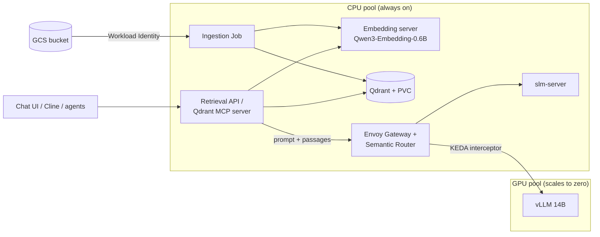

# RAG Architecture Proposal

How to add retrieval-augmented generation (RAG) to this stack. This document
answers five questions:

1. Managed service or self-hosted?
2. Which vector database?
3. How do documents get into it?
4. How does it fit vLLM, GKE and KEDA?
5. What do we build first?

Nothing is deployed yet. Each component lands in its own follow-up PR.

## Summary

| Layer | Choice | Why |
|---|---|---|
| Approach | Standard open-source components in the cluster | Managed Google RAG does not plug into our self-hosted models; turnkey platforms are too heavy for the system node |
| Vector database | Qdrant, 1 replica + PVC | Official GKE deployment guide, one of the options in Google's RAG-on-GKE reference, hybrid search built in |
| Embeddings | Qwen3-Embedding-0.6B on CPU, always warm | Multilingual, same family as our chat models, never wakes the GPU |
| Ingestion | Kubernetes Job: parse → split → embed → upsert | Batch work, no service to keep running |
| Chat model | Existing tiers through the gateway | Nothing changes on the GPU path |

## Constraints of our stack

| Constraint | Consequence |
|---|---|
| Self-hosted models behind an OpenAI-compatible gateway | RAG components must run in-cluster and speak the OpenAI API |
| GPU pool scales to zero, 3-4 min cold start | Nothing on the query path may run on the GPU |
| System node (e2-standard-4) is near capacity (`semantic-routing-walkthrough.md`) | Qdrant and the embedding server need new CPU capacity |
| CPU tier reads prompts at ~20-30 tok/s (`cost-checkpoint.md`) | Adding ~700 tokens of retrieved context costs ~30 s before the first token on the CPU tier |
| Idle cost target ~$100/mo | No always-on managed index; prefer components that fit on a small node |

## 1. Managed or self-hosted?

| Option | What it is | Fit |
|---|---|---|
| Vertex AI Search | Fully managed: point it at documents, Google handles crawling, chunking, retrieval | No. Models and index live outside the cluster |
| Vertex AI RAG Engine | Managed RAG pipeline with configurable parsing, chunking and embeddings | No. Vector stores are limited to RagManagedDb, Vertex Vector Search, Feature Store, Weaviate and Pinecone (no Qdrant or pgvector on GKE), and it is designed around Vertex-hosted models |
| RAGFlow, Dify, Open WebUI | Self-hosted RAG platforms with their own UI and storage | No. Each ships its own database stack and UI, duplicating our gateway and chat UI |
| NVIDIA RAG Blueprint | Helm chart built on NIM microservices | No. Expects GPUs for its models and Elasticsearch or Milvus |
| **Standard components** | Vector DB + embedding server + ingestion job | **Yes.** Each piece has an official Helm chart or image and fits the existing conventions (ClusterIP, Bearer key, Workload Identity) |

The managed Google services remain the right answer for a team already
running on Vertex models. For this stack they would move the core outside the
cluster.

## 2. Vector database

| Option | Hosting | Fit |
|---|---|---|
| **Qdrant** | Self-hosted on GKE ([official guide](https://docs.cloud.google.com/kubernetes-engine/docs/tutorials/deploy-qdrant)) or Qdrant Cloud | **Recommended.** Light footprint, one of the options in [Google's RAG-on-GKE reference](https://docs.cloud.google.com/kubernetes-engine/docs/tutorials/build-rag-chatbot). Hybrid search (dense + BM25, computed server-side since 1.15.2). Same Python client on a laptop (embedded mode) and in the cluster. Official MCP server for agents |
| pgvector | Self-hosted on GKE or Cloud SQL / AlloyDB | Alternative if we want a managed Postgres. Adds a Cloud SQL instance to the bill |
| Weaviate, Milvus, Elasticsearch | Self-hosted or cloud | Heavier than needed at our scale |
| Vertex AI Vector Search | Managed | Built for much larger corpora; managed index billed outside the cluster |

## 3. From documents to vectors

This is indexing, not training: the models are not modified. Documents are
cut into passages, each passage is turned into a vector, and vectors are stored
in Qdrant. At question time the closest passages are pasted into the prompt.

| Step | Tool | Notes |
|---|---|---|
| Parse | Markdown and HTML as-is; [Docling](https://github.com/docling-project/docling) for PDF, DOCX, PPTX | Docling converts everything to Markdown, so one pipeline handles all formats |
| Split | LangChain `MarkdownHeaderTextSplitter` + size limit (~1200 chars, 200 overlap) | Standard splitter; matched a hand-written one in our test |
| Contextualise | Prefix each passage with its file and heading path | Measured +10 points of retrieval accuracy |
| Embed | Qwen3-Embedding-0.6B, served by [TEI](https://huggingface.co/docs/text-embeddings-inference/supported_models) (CPU image) or llama.cpp `--embedding` | Both expose OpenAI-compatible `/v1/embeddings`; pick by benchmarking on an e2 node |
| Store | Qdrant collection, IDs derived from `file#position` | Re-running ingestion is idempotent |
| Trigger | CronJob first; then Cloud Storage event → Job, as in Google's reference | Reads the bucket with Workload Identity |

Later improvement: [contextual retrieval](https://www.anthropic.com/engineering/contextual-retrieval)
(an LLM writes one context sentence per passage before embedding; Anthropic
reports 35-67% fewer failed retrievals). It needs one LLM call per passage,
but only during ingestion. That suits scale-to-zero: an ingestion batch wakes
the GPU once, the 14B processes every passage, and the pool scales back down.

## 4. How it fits vLLM, GKE and KEDA

| Component | Placement | Scaling | Notes |
|---|---|---|---|
| Qdrant | CPU pool | Always on | ClusterIP, API key secret, PVC |
| Embedding server | CPU pool | Always on | Called directly, not through the semantic router (built for chat completions) |
| Ingestion | CPU pool | Job / CronJob (KEDA ScaledJob possible later) | Only runs when documents change |
| Retrieval API or Qdrant MCP server | CPU pool | Always on | Sends the final prompt through the gateway with the existing Bearer key; the MCP server lets Cline or an agent call search as a tool |
| vLLM, llama.cpp, KEDA | Unchanged | Unchanged | GPU scale-to-zero untouched |

## Measuring quality

RAG failures are mostly retrieval failures: if the right passage is not in the
prompt, no model can answer. The standard practice is to build the evaluation
set before tuning anything.

| Level | What | Tool |
|---|---|---|
| Retrieval | 50-100 questions with the document that answers each; hit@k and MRR after every change | Small script (prototype already has one) |
| Answers | Faithfulness to the passages, relevance, context precision and recall | [Ragas](https://docs.ragas.io/) |

Every later improvement (hybrid search, reranking, contextual retrieval) is
kept only if these numbers go up.

## Operational notes

| Topic | Note |
|---|---|
| Embedding model is locked to the index | Changing the embedding model means re-embedding every document. Pick it once, version the collection name |
| Exact identifiers | Error codes, model names and resource names (`invalid_upstream_json`, `vllm-api-key`) are where pure vector search is weakest. Qdrant hybrid search (BM25 + dense) covers them, which matters for troubleshooting docs |
| Access control | Store source, team or sensitivity as Qdrant payload and filter at query time, so one collection can serve several audiences |
| Data residency | Documents, vectors and prompts never leave the cluster; the only external read is the GCS bucket |
| Reranking later | vLLM serves a `/rerank` endpoint. Cross-encoders such as bge-reranker work directly; Qwen3-Reranker needs a converted checkpoint |

## 5. Build order

| PR | Content |
|---|---|
| 1 | This document |
| 2 | Qdrant (Helm values, PVC, API key, ClusterIP) |
| 3 | Embedding server + TEI vs llama.cpp benchmark on CPU |
| 4 | Ingestion Job (Docling, splitter, embed, upsert) |
| 5 | Retrieval API and/or Qdrant MCP server, evaluation set |
| Later | Hybrid search, reranking, contextual retrieval |

## Decisions to take together

1. **Capacity.** Resize the system pool (e2-standard-8, ~+$98/mo) or add a
   small CPU pool (e2-standard-2, ~+$50/mo). Estimates from `cost-checkpoint.md`.
2. **Which tier answers RAG questions.** CPU: no GPU wake, ~30 s to first
   token. GPU: fast once warm, one wake per idle period.
3. **Integration.** Retrieval API, MCP server, or both.
4. **First corpus.** Which documents, and the bucket layout.

## What the local prototype taught us

Built on a laptop (Ollama, Qwen3-Embedding-0.6B, Qwen3-4B-Instruct, embedded
Qdrant) over this repository's docs, measured on 20 questions with known
answers:

| Lesson | Evidence |
|---|---|
| Measure retrieval, do not eyeball answers | A badly worded query instruction dropped accuracy from 95% to 65% while answers still looked fine |
| Use standard splitters | LangChain splitter 90% vs hand-written 95%: one question apart |
| Keep headings with each passage | 85% without, 95% with |
| The model can say "not covered" | Out-of-scope question scored 0.33 vs 0.5-0.65 for answerable ones, and the model declined |
| Moving to the cluster is configuration | Same OpenAI API and Qdrant client locally and in-cluster |

Accuracy = share of questions where the top retrieved passage comes from the
right document.

## References

- [Deploy a Qdrant vector database on GKE](https://docs.cloud.google.com/kubernetes-engine/docs/tutorials/deploy-qdrant)
- [Build a RAG chatbot with GKE and Cloud Storage](https://docs.cloud.google.com/kubernetes-engine/docs/tutorials/build-rag-chatbot)
- [Vector database choices in Vertex AI RAG Engine](https://docs.cloud.google.com/vertex-ai/generative-ai/docs/rag-engine/vector-db-choices)
- [NVIDIA RAG Blueprint on Kubernetes](https://docs.nvidia.com/rag/latest/deploy-helm-from-repo.html)
- [Qdrant hybrid search](https://qdrant.tech/articles/hybrid-search/) · [Qdrant MCP server](https://github.com/qdrant/mcp-server-qdrant)
- [Docling](https://github.com/docling-project/docling)
- [Text Embeddings Inference](https://huggingface.co/docs/text-embeddings-inference/supported_models) · [vLLM embeddings](https://docs.vllm.ai/en/latest/models/pooling_models/embed/)
- [Anthropic: Contextual Retrieval](https://www.anthropic.com/engineering/contextual-retrieval)