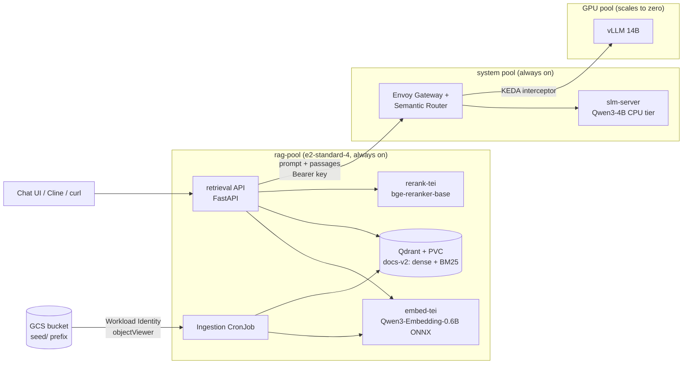
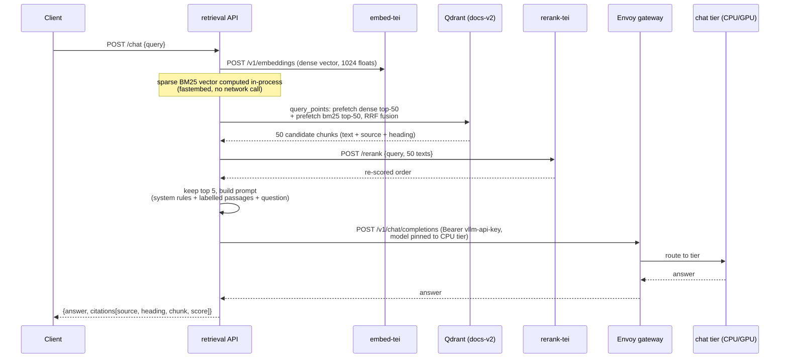
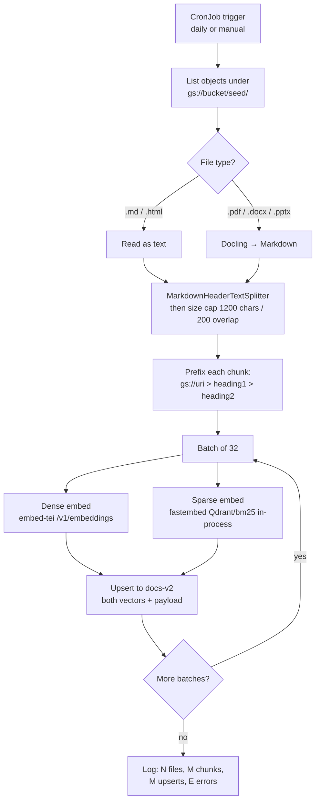

# RAG Implementation — Architecture, Tuning and Operations

Technical reference for the retrieval-augmented generation stack on this
cluster. Design rationale lives in `docs/rag-architecture.md`; this document
describes what is actually deployed, how the pieces talk to each other, how
they were tuned, and where the stack sits relative to 2026 industry practice.

Status: deployed and quality-gated on 2026-09-30. Retrieval quality on the
46-question golden set: **hit@1 0.90, hit@5 1.00, MRR 0.95**.

---

## 1. Components

Everything runs in the `rag` namespace on a dedicated CPU node pool
(`rag-pool`, e2-standard-4, label `workload=rag`). Nothing on the query path
touches the GPU pool, so KEDA scale-to-zero is unaffected. All services are
ClusterIP; all credentials live in Kubernetes secrets created out-of-band.

| Component | Image / chart | Role | Key configuration |
| --- | --- | --- | --- |
| Qdrant | `qdrant/qdrant:v1.15.5` (Helm) | Vector database | 10Gi `standard-rwo` PVC, API key from secret `qdrant-key`, collection `docs-v2`: named dense vector (1024-dim, cosine) + sparse vector `bm25` (IDF modifier) |
| `embed-tei` | `ghcr.io/huggingface/text-embeddings-inference:cpu-1.9.4` | Dense embedding server | ONNX Runtime backend, model `onnx-community/Qwen3-Embedding-0.6B-ONNX`, `--pooling last-token --max-batch-tokens 1024 --max-client-batch-size 128`, API key from `embed-apikey` |
| `rerank-tei` | same TEI image | Cross-encoder reranker | Model `Xenova/bge-reranker-base` (ONNX), same API key |
| `retrieval` | `rag/retrieval` (FastAPI, AR image) | Query API | `/search`, `/chat`, `/healthz`; embeds queries (dense via `embed-tei`, sparse in-process via fastembed), fuses, reranks, prompts the gateway |
| `ingest` (CronJob) | `rag/ingest` (AR image) | Offline ingestion | GCS → parse → split → embed → upsert; Workload Identity via `rag-ingest-sa`; daily schedule, manual runs via `--from=cronjob` |
| GCS bucket | `vllm-gke-rag-docs-*` (Terraform) | Document source | Versioned, uniform access; only external read in the whole system |

Supporting pieces outside the namespace: the Envoy gateway data plane
(`envoy-vllm-semantic-router-*` service) and the chat tiers behind it
(`slm-server` CPU tier always on, vLLM 14B GPU tier scaled to zero).

### 1.1 Cluster-level view

The embedding model is **locked to the index**: `docs-v2` stores vectors from
Qwen3-Embedding-0.6B and can only be queried with the same model. Changing it
means a new versioned collection and a full re-embed.

---

## 2. How the components communicate

### 2.1 Query path (online)

Four network calls plus one in-process computation, all inside the cluster:

Two things to notice about this shape:

- **The embedding model never talks to the database.** The retrieval service
  orchestrates: embed → search → rerank → prompt. Each component has one job.
- **The gateway decides the tier**, not the RAG. The deployment pins
  `GATEWAY_MODEL=qwen3-4b-cpu` (no GPU wake, predictable latency); pointing it
  at the 14B model name makes the GPU tier answer RAG questions with zero
  changes anywhere else.

`/search` is the same flow minus the gateway call — it returns the ranked
passages and is what the evaluation harness measures.

### 2.2 Ingestion path (offline)

Step by step:

1. **List** — `google-cloud-storage` lists objects under the configured
   prefix, authenticated with Workload Identity (no key files anywhere; the
   CronJob's service account `ingestion` is bound to `rag-ingest-sa`).
2. **Parse** — Markdown/HTML pass through as-is; PDF/DOCX/PPTX go through
   Docling, which converts everything to Markdown, so one pipeline handles
   all formats.
3. **Split** — LangChain `MarkdownHeaderTextSplitter` keeps each section's
   heading path in metadata; `RecursiveCharacterTextSplitter` enforces the
   ~1200-char cap with 200 overlap.
4. **Prefix** — every chunk is prepended with `gs://bucket/path > h1 > h2`.
   This is the cheap, deterministic version of "contextual retrieval":
   headings carry the document context into the embedding.
5. **Embed** — dense vectors from `embed-tei` in batches of 32; sparse BM25
   vectors computed in the same process with fastembed (Qdrant's OSS image
   has no server-side text inference — verified empirically).
6. **Upsert** — point ID is `uuid5(NAMESPACE_URL, "<gcs_uri>#<chunk_index>")`.
   Deterministic IDs make re-runs **idempotent**: same document → same ID →
   overwrite, never duplicate. Verified live: two consecutive runs left the
   point count at exactly 80.
7. **Payload** — every point carries `source`, `heading_path`, `chunk_index`,
   `text`, `ingested_at`. Citations and future payload filters (team,
   sensitivity) build on this.

Config is via environment variables (chunk size, overlap, batch size,
collection, endpoints) — nothing tunable is hardcoded, per the eval-discipline
rule.

---

## 3. Tuning: what was tried, measured, kept, discarded

Every retrieval-affecting change was gated by the same eval
(`eval/run_eval.py` over `eval/golden_questions.yaml`, 46 questions:
paraphrased, ≥5 exact-identifier, 4 out-of-scope). Reports are committed
under `eval/reports/`.

### 3.1 Metric ladder

| Stage | hit@1 | hit@5 | MRR | Verdict |
| --- | --- | --- | --- | --- |
| Dense vectors only | 0.62 | 0.95 | 0.76 | Phase 4 gate passed (≥0.90 / ≥0.75) |
| + BM25 hybrid, RRF fusion | 0.86 | **1.00** | 0.92 | **Kept** — exact-identifier questions fixed |
| + cross-encoder rerank (50→5) | 0.90 | 1.00 | 0.95 | **Kept** |
| Contextual retrieval | — | — | — | **Deferred** (see §5) |

The hybrid stage mattered most for the known vector weakness: literal
identifiers (`invalid_upstream_json`, `vllm-api-key`). BM25 catches exact
tokens; RRF fusion (server-side in Qdrant) merges the rankings without score
normalization hacks.

### 3.2 Embedding server selection (the hard part)

Two candidates were benchmarked on the CPU pool (`bench/results.md` has the
full record):

| Candidate | Outcome |
| --- | --- |
| llama.cpp `--embedding`, Q8_0 GGUF | Correct vectors, sanity PASS, but ~3.3 s per 4-token request regardless of CPU quota (fixed server-path cost, not starvation — node idle at 15%), and batch fan-out to 4 parallel slots OOM-crashed until serialized with `--parallel 1`. **Deleted.** |
| TEI candle backend (safetensors fp32) | OOMKilled during warmup at 2, 3, 4 and 6Gi — candle pre-allocates a full `max-batch-tokens` batch. |
| **TEI ORT backend (ONNX export)** | **Winner** after three fixes: use `onnx-community/Qwen3-Embedding-0.6B-ONNX` (the upstream repo has no ONNX files); add `--pooling last-token` (the ONNX repo lacks `1_Pooling/config.json`; Qwen3 embeddings are last-token-pooled); cut `--max-batch-tokens` to 1024 (warmup memory scales with this knob); raise `--max-client-batch-size` past the default 32 or bulk requests get HTTP 422. |

Result: ~110 ms per query embedding in-cluster, 2.3Gi RSS, ~180 tok/s
sustained on bulk batches.

Two honest consequences:

- **The pool had to grow.** The plan-sized e2-standard-2 (8GB) could not host
  either server in any configuration tried. The pool is now e2-standard-4
  (~+$50/mo).
- **The plan's latency budgets were recalibrated.** p50 < 100 ms came out at
  ~110 ms in-cluster (accepted — invisible next to LLM latency); batch-of-100
  < 5 s is physically unattainable for a 0.6B fp32 model on e2 cores
  (accepted — ingestion is async).

### 3.3 Reranker

TEI serving `Xenova/bge-reranker-base` (ONNX). Retrieval fuses dense+BM25,
takes 50 candidates, reranks, keeps 5. `Xenova/bge-reranker-v2-m3` does not
exist (401 from HF); the `base` model was the pragmatic ONNX choice. The
trade-off knob is `RERANK_CANDIDATES`: at 50, a reranked query costs ~15–30 s
of cross-encoder time on the e2 node; lowering it trades quality for latency.

---

## 4. Caveats and known limits

| Caveat | Impact | Mitigation / status |
| --- | --- | --- |
| Golden set is small (46 q over 11 docs) | hit@5 1.00 is likely a **ceiling effect**, not proof of perfection | Extend the set with every new content batch (same commit); grow it when real queries fail |
| TEI re-downloads ~1.2GB of weights on every restart (emptyDir cache) | Slow restarts (~2–4 min) | Deferred: PVC for the HF cache |
| Rerank latency ~15–30 s/query at 50 candidates | /chat feels slow interactively | `RERANK_CANDIDATES` knob; consider smaller candidate pool for interactive use |
| Scanned/image-only PDFs | Docling extracts nothing useful without OCR | Known blind spot; log during ingestion |
| Embedding model lock | Swapping the model invalidates the index | Versioned collections (`docs-v2`); never mix models in one collection |
| Gateway data-plane service name has an install-specific suffix | `GATEWAY_URL` goes stale on gateway reinstall | Discovery command documented in `k8s/rag/README.md` |
| API keys are `kubectl`-created, not in git | Required by repo policy | Documented in `k8s/rag/README.md`; the `vllm-api-key` must also be mirrored into the `rag` namespace |
| Ingestion failures exit non-zero but upsert what succeeded | Partial batches land in the index | Job logs count errors; idempotent re-runs heal |
| Only access path is `kubectl port-forward` | No ingress, by design (data residency) | Matches the rest of the stack |

---

## 5. Where this stack stands vs. 2026 practice

The industry settled into three generations: **RAG v1** (dense-only, 2023),
**RAG v2** (hybrid + rerank, the 2024–2026 production baseline), **RAG v3**
(agentic loops, graph-structured and contextual retrieval, 2025–2026 frontier)
— see e.g. [DEV: RAG v1/v2/v3](https://dev.to/riddhesh/should-you-be-using-rag-in-2026-28ef),
[Agentic RAG reference architecture](https://iotdigitaltwinplm.com/agentic-rag-architecture-retrieval-agents-2026/),
[Galileo: naive to agentic](https://galileo.ai/blog/rag-architecture).

| 2026 practice | Consensus status | This stack |
| --- | --- | --- |
| Structure-aware chunking + overlap | Baseline ([CallMissed](https://www.callmissed.com/blog/rag-best-practices-2026)) | ✅ MarkdownHeaderTextSplitter + 1200/200 cap |
| Hybrid search (dense + sparse) | "Baseline regardless of generation" | ✅ BM25 + dense, server-side RRF |
| Cross-encoder rerank, top ~20–50 | "Highest-ROI step" | ✅ bge-reranker-base, 50→5 |
| Retrieval eval as first-class metric | Consensus ([Techment](https://www.techment.com/blogs/rag-in-2026/)) | ✅ Golden set + hit@k/MRR gate; every change ships a report |
| Modern document parsing | Docling-type converters | ✅ Docling for PDF/DOCX/PPTX |
| Metadata filtering / access control | Standard for multi-tenant | 🟡 Payload fields exist (`source`, `heading_path`); `team`/`sensitivity` deferred until needed |
| Contextual retrieval / late chunking | Frontier chunking ([AI Workflow Lab](https://aiworkflowlab.dev/article/rag-chunking-strategies-late-contextual-semantic-2026)) | 🟡 Heading-prefix (cheap version) in place; LLM-contextual deferred — no headroom on the seed set (hit@5 already 1.00) |
| Agentic RAG (planner calls retrieval as a tool) | 2026 frontier | ❌ Deferred: Qdrant MCP server is the documented entry point |
| GraphRAG / multi-hop | Frontier, high construction cost | ❌ Not needed for a single-repo doc corpus |
| HyDE / query rewriting | Situational | ❌ Not needed yet; revisit if paraphrase-heavy queries fail |
| Long-context "no-RAG" (1M-token models) | Emerging alternative | N/A — self-hosted 14B/4B; RAG is the right fit |
| Corpus poisoning / prompt-injection hygiene | [Growing concern](https://www.techwithcolonel.com/artifact/rag-state-of-the-art-2026.html) | 🟡 Mitigated structurally: private bucket, no public write path, citations exposed |

**Verdict:** a solid, eval-driven RAG v2 — exactly the production baseline
2026 sources describe, with the eval discipline most deployments skip. The v3
items (contextual retrieval, agentic tool-calling) are deliberately sequenced,
not missing: each has a measurable trigger.

### Roadmap triggers (when to revisit what)

1. **Content scale-up** (next): move the full doc set into the bucket, extend
   the golden set in the same commit, re-ingest, re-eval. If hit@5 drops
   below 0.90, the bottleneck is chunking or search — fix before adding more.
2. **Contextual retrieval**: when the eval shows real misses on the scaled
   corpus. Needs one LLM call per chunk at ingestion (CPU tier can do it; GPU
   wake is optional), a `docs-v3` collection, and a before/after report.
3. **Qdrant MCP server**: when agents (Cline) should call search as a tool
   instead of going through `/chat`.
4. **Reranker upgrade**: if `base` shows weak discrimination on the scaled
   corpus, try a larger cross-encoder (or ColBERT-style late interaction).
5. **Housekeeping**: garbage-collect Qdrant points whose source file was
   deleted from the bucket; HF-cache PVC for TEI; payload-based access
   control when a second audience appears.
