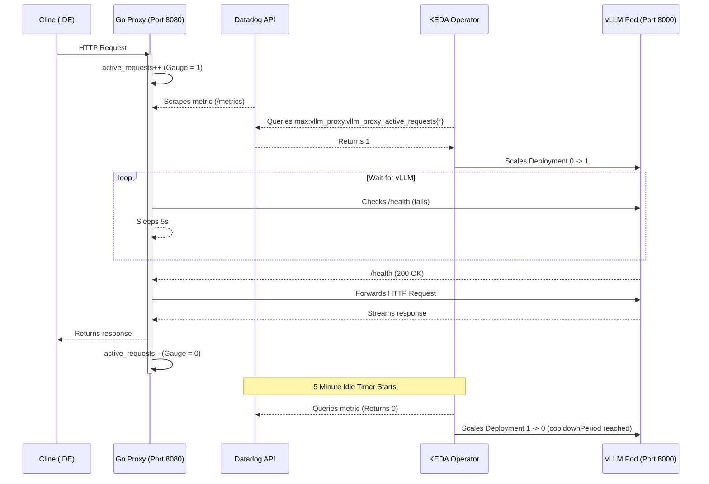

# Scale-to-Zero and Scale-to-One Architecture

This document details the mechanics of the custom Scale-to-Zero architecture designed for synchronous HTTP clients (like the Cline IDE extension).

## Why a Custom Proxy?
Standard serverless frameworks (like Knative) can be heavy, and asynchronous queue-based scaling (like KEDA + Redis) fails for synchronous HTTP clients because the client drops the connection while waiting for the async queue to be processed. 

To solve this, we built a **Lightweight Go Reverse Proxy**.

## Architecture Graph

## How Scaling to 1 Works (Cold Start)
1. The `vllm-proxy` sits in front of the `vllm-server` Kubernetes Service.
2. An HTTP request hits the Proxy. The Proxy increments the Prometheus gauge `vllm_proxy_active_requests` to `1`.
3. Datadog scrapes this metric. KEDA polls Datadog every 15 seconds.
4. KEDA detects `active_requests > 0` and triggers the Horizontal Pod Autoscaler (HPA) to scale the vLLM deployment from `0` to `1`.
5. **The Hold:** While the vLLM pod takes 3-4 minutes to spin up and load the model into the GPU, the Go Proxy intentionally blocks and holds the client's HTTP connection open, polling `vLLM/health` every 5 seconds.
6. Once vLLM is ready, the Proxy forwards the request.

## How Scaling to 0 Works (Cooldown)
1. When the request finishes, the Proxy decrements `vllm_proxy_active_requests` back to `0`.
2. KEDA's ScaledObject is configured with a `cooldownPeriod` of `300` (5 minutes).
3. If the metric remains at `0` for 5 consecutive minutes, KEDA natively scales the deployment down to `0` replicas.
4. GKE's Cluster Autoscaler then waits ~10 minutes before destroying the underlying GPU node to save cloud costs.

## ⚠️ Known Problems & Edge Cases Resolved

### Problem 1: vLLM Cold Start Metrics Quirk
**Issue:** When the pod scales up from zero, it is a brand new instance. vLLM does not emit performance metrics (TTFT, TPOT) until the *first* request finishes processing.
**Observation:** Dashboards will appear to have "lost" metrics during the 3-4 minute cold-start window. This is normal; metrics will instantly reappear once the cold-start generation completes.

### Problem 2: GCP IAM & Image Pulling
**Issue:** The custom proxy image is built via Cloud Build and pushed to GCP Artifact Registry. The GKE nodes could not pull the image, resulting in `ImagePullBackOff`.
**Solution:** The default GKE compute service account (`vllm-sa@...`) MUST be granted the `roles/artifactregistry.reader` IAM role to authenticate with the Artifact Registry.
