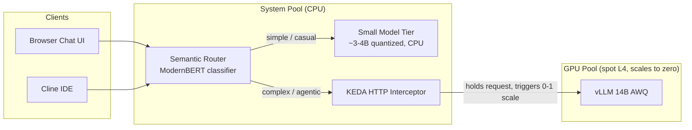

# Evolution: Semantic Routing with Tiered Models

> **Status:** Context & instruction document. This is NOT the implementation plan.
> Its purpose is to give a future planning session (human or AI agent) everything
> needed to produce a concrete, incremental implementation plan.

## 1. Background: Where We Are

The project serves **Qwen 2.5 Coder 14B AWQ** on a single spot L4 GPU (`g2-standard-8`)
on a zonal GKE cluster, with scale-to-zero for cost control. Two scale-to-zero
concepts have been explored:

| Branch | Mechanism | Metric source | Status |
|---|---|---|---|
| `main` | KEDA **HTTP add-on** (`HTTPScaledObject`) | Interceptor pending-request count | Active base going forward |
| `proxy-datadog-scaling` | Custom Go proxy (holds connection, exposes gauge) | Datadog query from KEDA | Paused — Datadog trial ended |

Key facts about the `main` mechanism (from `k8s/vllm-chart/templates/httpscaledobject.yaml`
and `k8s/install_keda.sh`):

- The KEDA HTTP add-on **interceptor** receives the request, holds it while the
  deployment is at 0 replicas, scales the target 0→1 on `targetPendingRequests: 1`,
  and forwards when ready.
- Scale-down to 0 happens after `scaledownPeriod: 300` seconds of no pending requests.
- This means the connection-hold behavior that the custom Go proxy was built for
  on the Datadog branch **already exists on `main`**, provided by the interceptor.

Clients are **synchronous** (Cline IDE extension, and a browser chat UI to be added).
Any client that speaks the OpenAI API protocol can connect to the same stack.

## 2. The Goal

Add a **model-aware routing layer** so that:

1. **Simple traffic** (casual browser chat, single-turn scripts) is served by a
   **small CPU model** that is cheap and always (or quickly) available.
2. **Heavy traffic** (Cline agentic code work, complex prompts) is served by the
   **14B GPU model**, which keeps its scale-to-zero behavior.
3. The routing decision is made by a **semantic router** — a lightweight classifier
   that inspects each request and picks the tier.

Explicitly **out of scope for this evolution** (deferred, not rejected):

- Embedding models, RAG, codebase indexing, rerankers
- Image/video generation (incompatible serving stack, competes for the same L4)
- Multi-LoRA adapters, speculative decoding, prefix caching tuning

## 3. Target Architecture

Routing signals, in order of reliability:

1. **Client identity / requested model name** — Cline sends an explicit model name;
   the chat UI can send `"model": "auto"`. A pinned model name bypasses classification
   and forces the GPU tier. This is the strongest signal and the cheapest to implement.
2. **Semantic classification** — the router's ModernBERT classifier decides
   intent/complexity for unpinned requests.
3. **Escalation bias** — when uncertain, route to the GPU tier. A false positive
   costs a GPU wake (cents + cold-start latency); a false negative silently serves
   bad code. The router must be tuned toward escalation.

## 4. Critical Design Decision: What Happens to the Go Proxy?

The custom Go proxy from `proxy-datadog-scaling` does two jobs: (a) hold the
synchronous connection during cold start, (b) expose the metric KEDA scales on.
**On `main`, job (a) is done by the KEDA interceptor and job (b) by pending-request
counting.** Moving the proxy to `main` unchanged would duplicate existing machinery.

The planning session MUST resolve this explicitly. Options:

- **Option A — Drop the proxy.** The semantic router + KEDA HTTP add-on cover
  routing and waking. Simplest architecture, least code to maintain.
- **Option B — Keep the proxy as a thin gateway** in front of the router, repurposed
  for what the interceptor cannot do: per-client logging, traffic measurement
  (needed to tune the classifier later), and future gateway duties (auth, rate limits).
- **Option C — GPU-tier proxy.** Keep the proxy only on the GPU path
  (router → proxy → vLLM) if custom wake logic beyond the interceptor's is needed.

Recommendation to evaluate during planning: **start with Option A**, and only
re-introduce the proxy (Option B) when traffic logging is actually needed to tune
routing. Do not port Datadog-specific code; it has no consumer on `main`.

## 5. Feasibility Notes & Constraints

### System pool sizing (main risk)

The system pool is `e2-standard-2` (2 vCPU, 8 GB). It already runs the KEDA
operator, HTTP interceptor, and external scaler. Adding:

- **Semantic router** — small footprint (classifier inference on CPU), fine.
- **CPU SLM (3-4B quantized)** — needs ~4-6 GB RAM and will be slow on 2 vCPU.
  The plan MUST evaluate bumping the system pool (e.g. `e2-standard-4`) and
  quantify the added monthly cost vs. the GPU savings the tier provides.

### CPU tier cold start

If the CPU tier also scales to zero (via its own `HTTPScaledObject`), its cold
start is seconds-to-a-minute, not 3-4 minutes. Decide during planning whether the
CPU tier is `minReplicas: 1` (always warm, simpler, still cheap) or also 0→1.

### Other standing constraints (from agent.md)

- Public repo: no secrets, Workload Identity only, pre-commit hooks enforced.
- Zonal cluster, spot GPU: the GPU tier cold start remains 3-4 minutes; the
  router must not make this worse (no chained wake-ups on the GPU path).
- Synchronous clients only: no queue-based async scaling patterns.
- Learning project: build incrementally, explain the *why*, no comments in code.

## 6. Semantic Router Candidates (for deep dive)

The plan MUST pick one after evaluating these:

1. **vLLM Semantic Router** (`vllm-project/semantic-router`) — purpose-built for
   vLLM serving, ModernBERT-based intent/complexity classification, "Mixture-of-Models"
   architecture. Best conceptual fit; evaluate deployment maturity and footprint.
   - https://vllm.ai/blog/semantic-router
   - https://vllm-sr.ai/
   - https://developers.redhat.com/articles/2025/09/11/vllm-semantic-router-improving-efficiency-ai-reasoning
2. **RouteLLM** (LMSYS) — OpenAI-compatible drop-in, routers trained on Chatbot
   Arena preference data; published cost/quality trade-off benchmarks.
   - https://github.com/lm-sys/RouteLLM
   - https://klymentiev.com/blog/llm-router
3. **Aurelio `semantic-router`** — embedding-similarity routing library (route
   prototypes + utterances). Simplest to embed in a small custom sidecar; the least
   "gateway" of the three.
   - https://github.com/aurelio-labs/semantic-router
4. Background survey for vocabulary and trade-offs:
   - https://arxiv.org/html/2603.04445v3 (Dynamic Model Routing and Cascading survey)
   - https://github.com/ymoslem/awesome-llm-routing-cascading

## 7. What the Implementation Plan Must Cover

When writing the actual plan, address each of these as a concrete, ordered phase:

1. **Router selection & deployment** — pick from section 6; deploy on the system
   pool; define route categories (at minimum: `code-agentic`, `code-simple`, `chat-casual`).
2. **CPU model tier** — model choice (Qwen coder-class ~3-4B quantized), serving
   runtime, resource sizing, pool resizing decision, `minReplicas` decision.
3. **GPU path integration** — router backend pointing at the KEDA interceptor
   service so the existing `HTTPScaledObject` wake behavior is preserved end to end.
4. **Client wiring** — Cline pinned to the GPU tier; browser chat UI (OpenAI-compatible)
   sending unpinned/`auto` requests through the router.
5. **Validation** — prove: (a) chat request → CPU tier, no GPU wake; (b) Cline
   request → GPU wakes via interceptor, connection held, response streamed;
   (c) misrouted-simple request is acceptable, misrouted-complex is caught by
   escalation bias.
6. **Cost checkpoint** — compare new system-pool cost + GPU wake frequency against
   the pre-router baseline. If the CPU tier doesn't measurably reduce GPU wakes,
   document why and reconsider.

## 8. Open Questions for the Planning Session

- Which router from section 6, and why?
- Does the Go proxy survive (Option A/B/C, section 4)?
- What quantized CPU model fits the system pool, and does the pool need resizing?
- Does the CPU tier scale to zero or stay warm?
- How are route categories validated without production traffic history?
