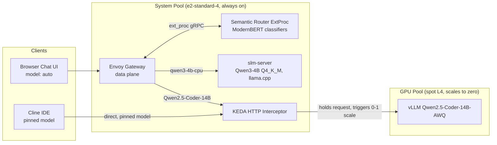

# Semantic Routing Walkthrough

This document explains the tiered routing stack added on top of the scale-to-zero
vLLM deployment: what each new component is, why it exists, and how traffic flows.

## Topology

## Why these components

### Why a semantic router at all

The GPU tier costs real money per wake (spot L4 provisioning + 3-4 min cold start)
and the whole point of the stack is to keep it at zero when the workload does not
need a 14B model. A classifier that reads each request and picks a tier lets casual
chat stay on a cheap CPU model while agentic coding work escalates to the GPU.

### Why vLLM Semantic Router

Among the candidates (RouteLLM, Aurelio semantic-router), vLLM Semantic Router is
the only one purpose-built as a serving-layer component: ModernBERT-based domain
and keyword classification running in Rust/Candle, explicit decision rules with
priorities, and first-class Kubernetes deployment via Envoy's ExtProc protocol.
The trade-off accepted here: it pulls in the Envoy Gateway + Envoy AI Gateway
stack, which is heavier than a single Python sidecar but is also the industry
standard path for model-aware gateways (Gateway API Inference Extension uses the
same ExtProc mechanism).

### Why Envoy AI Gateway and its CRDs

The semantic router does not terminate HTTP itself in this topology. The
responsibility split is:

| Concern | Owner |
|---|---|
| Public listener, routing, buffering, timeouts | Envoy Gateway (Gateway API data plane) |
| OpenAI API translation, model-name extraction (`x-ai-eg-model`), backend abstraction (`AIServiceBackend`) | Envoy AI Gateway |
| Request classification and tier selection | Semantic Router ExtProc |

The AI Gateway CRDs (`AIGatewayRoute`, `AIServiceBackend`) exist so the data plane
understands "route by the model field of an OpenAI request" instead of raw paths.
The ExtProc sidecar is inserted as the **first** HTTP filter (via
`EnvoyPatchPolicy`) so classification happens **before** route selection: the
router rewrites the effective model, and the `AIGatewayRoute` then matches on it.

### Why the escalation bias is in `providers.defaults`

The decision config routes only three clear cases:

- `code_agentic` (computer science / engineering domains, agentic keywords) → GPU
- `technical_complex` (hard STEM domains) → GPU
- `chat_casual` (general knowledge, casual domains) → CPU

Everything unmatched falls through to `providers.defaults.model`, which is the
**GPU** model. A false positive (simple prompt wakes the GPU) costs cents and a
few minutes of latency. A false negative (complex code silently answered by a 4B
CPU model) produces bad code that looks plausible. The default therefore
escalates; only clearly-casual traffic stays cheap.

### Why the GPU model alias is the literal vLLM model name

vLLM's OpenAI server rejects requests whose `model` field does not match the
served model. The router's GPU model entry is named exactly
`Qwen/Qwen2.5-Coder-14B-Instruct-AWQ` so the forwarded body is accepted without
any rewriting. The CPU tier (llama.cpp) ignores the model name, so its alias
`qwen3-4b-cpu` is cosmetic.

### Why Cline bypasses the router

A pinned model name is the strongest and cheapest routing signal. Cline talks
directly to the KEDA interceptor (as it did before this evolution), which keeps
the GPU cold-start path free of extra hops: no ExtProc classification latency, no
gateway timeout to tune for the 3-4 minute hold. The router only classifies
**unpinned** traffic (`model: "auto"`) from the chat UI.

### Why the interceptor needed a new host

The KEDA HTTP add-on interceptor matches incoming requests against the
`HTTPScaledObject` `hosts` list. Requests forwarded by Envoy carry the original
client `Host` header (e.g. `localhost:8080` when port-forwarded), which was not in
the list — the interceptor would 404 them. `localhost:8080` was added to
`k8s/vllm-chart/templates/httpscaledobject.yaml`.

### Why the GPU route gets a 600s timeout

Envoy's default route timeouts (the demo uses 60s) would kill a request held by
the interceptor during a GPU cold start. The GPU rule in `AIGatewayRoute` sets
`request: 600s` / `backendRequest: 600s`; the CPU rule uses 300s because a 4B
model on 2-3 vCPU generates slowly.

### Why the CPU tier is always warm

The system node runs 24/7 regardless, so scaling the CPU tier to zero would save
nothing and add a cold start to the cheapest path. It is a plain Deployment with
`replicas: 1`, no `HTTPScaledObject`.

### Why the system pool grew to e2-standard-4

The e2-standard-2 (2 vCPU / 8 GB) could not hold KEDA + interceptor (~1.5 GB),
the Envoy stack (~1 GB), the router's ModernBERT classifiers (~0.5 GB), and
llama.cpp with Qwen3-4B Q4_K_M (~3-3.5 GB with KV cache). The e2-standard-4
(4 vCPU / 16 GB) adds roughly $49/mo on-demand in europe-west4; the Phase 6 cost
checkpoint compares this against the GPU wakes the tier avoids.

## Request lifecycle (chat UI, GPU asleep)

1. Chat UI POSTs `/v1/chat/completions` with `model: "auto"` to the Envoy gateway
   service (port-forwarded).
2. Envoy buffers the body (`ClientTrafficPolicy` raises the buffer to 50Mi) and
   streams it to the semantic router over gRPC ExtProc.
3. The router classifies domain/keywords, applies the decision table, and rewrites
   the effective model (`qwen3-4b-cpu` or `Qwen/Qwen2.5-Coder-14B-Instruct-AWQ`).
4. The `AIGatewayRoute` matches `x-ai-eg-model` and selects the backend.
5. CPU path: request lands on `slm-service`, response returns immediately.
   GPU path: request lands on the KEDA interceptor, which holds it, scales the
   deployment 0→1, the cluster autoscaler provisions the spot L4, and the request
   is forwarded once vLLM passes readiness. The client sees one long request that
   eventually streams.

## Files

| File | Purpose |
|---|---|
| `k8s/install_semantic_routing.sh` | Installs Envoy Gateway, AI Gateway CRDs + controller, the router chart, and the Gateway API resources |
| `k8s/semantic-router/values.yaml` | Router config: models, signals, decisions, escalation default |
| `k8s/semantic-router/gwapi-resources.yaml` | GatewayClass, Gateway, backends, `AIGatewayRoute`, ExtProc patch |
| `k8s/semantic-router/test-prompts.md` | Labeled synthetic prompts for routing validation |
| `k8s/vllm-chart/templates/slm-*.yaml` | CPU tier Deployment + Service |
| `k8s/vllm-chart/templates/httpscaledobject.yaml` | Interceptor host list incl. `localhost:8080` |

## Known verification points (Phase 5)

- Confirm the router emits model names (not LoRA-style aliases) into
  `x-ai-eg-model` — the route rules match on the full names.
- Confirm the client's `Authorization: Bearer` header passes through the gateway
  to vLLM; if the AI Gateway strips it, add a `BackendSecurityPolicy` referencing
  the existing `vllm-api-key` secret.
- If the gateway's upstream Host ever differs from the `hosts` list, prefer
  extending `hosts` over adding Envoy hostname rewrites.
