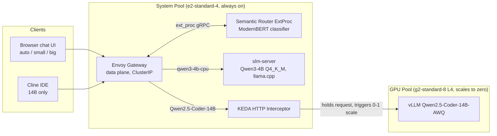

# Semantic Routing Architecture

Technical reference for the tiered routing stack. For day-to-day operation see
`implementation-guide.md`. For cost data see `cost-checkpoint.md`.

## Topology

## Components

| Component | Namespace | Role |
|---|---|---|
| Envoy Gateway (data plane) | envoy-gateway-system | HTTP listener, buffering, route selection |
| Envoy AI Gateway (controller) | envoy-ai-gateway-system | OpenAI API translation, model header extraction |
| vLLM Semantic Router | vllm-semantic-router-system | ExtProc classifier, tier selection |
| slm-server | vllm | CPU tier, Qwen3-4B Q4_K_M on llama.cpp, 1 replica always warm |
| vllm-server | vllm | GPU tier, Qwen2.5-Coder-14B-AWQ, scaled 0-1 by KEDA |
| KEDA HTTP add-on | keda | Holds requests during GPU cold start, pending-request scaling |

## Routing model

Every client sends requests to the same gateway endpoint. The `model` field
selects one of three modes:

| Mode | `model` value | Behavior |
|---|---|---|
| auto | `auto` | Router classifies the prompt and picks a tier |
| small | `qwen3-4b-cpu` | Always the CPU tier |
| big | `Qwen/Qwen2.5-Coder-14B-Instruct-AWQ` | Always the GPU tier |

Model names are case-sensitive. A pinned name is honored without classification
(router logs `reason_code: model_specified`, latency 0 ms). Classification runs
only for `auto`.

Client policy:

- **Cline** is pinned to the 14B model. Its traffic is agentic code work with
  large technical prompts; the small tier is not suitable for tool calling and
  multi-step editing.
- **The chat UI** exposes all three modes. `auto` is the default for mixed
  casual traffic.

## Decision rules

The classifier is ModernBERT-based topic classification plus keyword signals.
It does not estimate task complexity directly.

| Decision | Priority | Conditions | Target |
|---|---|---|---|
| code_agentic | 30 | domain computer science OR engineering, or code keywords (refactor, debug, schema, migrations, sql, docker, kubernetes, function, script, api, pytest, deploy, …) | GPU |
| technical_complex | 20 | domain math, physics, chemistry, biology | GPU |
| chat_casual | 10 | domain other, psychology, history, philosophy, business, economics, health, law | CPU |
| (default) | — | no decision matched | GPU |

The default rule implements escalation bias: unclassified or ambiguous traffic
goes to the GPU tier. A false positive costs one GPU wake; a false negative
serves a complex task from the small model, which is the unacceptable direction.

## Request flows

CPU path (`auto` classified casual, or pinned small):

1. Client POSTs `/v1/chat/completions` to the gateway.
2. ExtProc classifies the request and sets the effective model.
3. `AIGatewayRoute` matches `x-ai-eg-model: qwen3-4b-cpu` → `slm-service:8080`.
4. llama.cpp answers. Typical latency: seconds. No GPU wake.

GPU path (`auto` classified code/complex, or pinned big):

1. Same entry, effective model set to the 14B name.
2. Route matches → backend `keda-add-ons-http-interceptor-proxy.keda:8080`.
3. The interceptor holds the request, pending-request metric scales
   `vllm-server` 0→1, the autoscaler provisions the GPU node if absent.
4. When vLLM passes readiness, the interceptor forwards the held request.
5. Observed cold start: ~3-4 min with a warm model PVC, ~7.5 min with a cold
   PVC (first download). Scale-down after 300 s idle (`scaledownPeriod`).

Route timeouts: GPU rule 600 s, CPU rule 300 s. The GPU value must exceed the
cold-start hold or the gateway kills waiting requests.

## Integration details

### Interceptor host matching

The KEDA interceptor matches requests against the `HTTPScaledObject` `hosts`
list and returns 404 for unmatched hosts. Envoy rewrites the upstream
`:authority` to the backend FQDN, so the list must contain:

- `keda-add-ons-http-interceptor-proxy.keda.svc.cluster.local` (router-forwarded)
- `localhost`, `localhost:8000`, `localhost:8080` (port-forwarded clients)
- `vllm-service.vllm.svc.cluster.local` (in-cluster direct)

### ExtProc processing mode

The EnvoyPatchPolicy inserts the semantic-router filter as the first HTTP
filter with:

- `request_body_mode: BUFFERED` (classification needs the full prompt)
- `response_body_mode: NONE` and `allow_mode_override: false`

Response bodies must not reach the router. llama.cpp appends a non-standard
`timings` field to responses and final stream chunks, which the router's strict
decoder rejects (`invalid_upstream_json`, surfaced as 502 for non-streaming or
a terminal SSE error event instead of `[DONE]` for streaming). With overrides
allowed, the router opts back into response bodies per request; both settings
are required. Side effect: response-side router features (semantic cache,
stream reconstruction) are disabled. Request-side classification is unaffected.

Note: `SKIP` is not a valid value for body modes (headers only). An invalid
value silently drops the ext_proc filter from the listener; all requests then
fall through to the gateway catch-all direct response.

### Authentication

Both backends enforce the same Bearer token from the `vllm-api-key` secret:
vLLM via `VLLM_API_KEY`, llama.cpp via `LLAMA_API_KEY`. The gateway passes the
client `Authorization` header through unchanged. Unauthenticated requests get
401 from the backends.

### Network exposure

The Envoy data plane Service is `type: ClusterIP` (set on the `EnvoyProxy`
resource). Envoy Gateway defaults to `LoadBalancer`, which on GKE provisions a
public L4 load balancer; this is overridden. All access is via
`kubectl port-forward`.

### CPU tier scheduling

The system node (e2-standard-4) reserves ~3 CPU for KEDA, the Envoy stack, and
the router. The SLM Deployment requests 750m CPU / 4Gi and limits 3 CPU / 6Gi.
Higher requests leave the pod unschedulable (`Insufficient cpu`), and the
autoscaler then attempts GPU-pool scale-up for a CPU pod. Do not raise the SLM
CPU request without resizing the system pool.

## Validation record

Executed on the live cluster (2026-09-18 / 2026-09-20):

| Test | Expected | Observed |
|---|---|---|
| Casual prompts via `auto` | CPU answer, GPU stays at 0 | Pass (recipe, history, travel, finance) |
| Code/agentic prompts via `auto` | GPU answer | Pass (async refactor, race-condition debug, schema design, framework migration) |
| Pinned 14B via gateway | `model_specified`, GPU answer | Pass, 2m56s warm wake |
| Pinned `qwen3-4b-cpu` via gateway | `model_specified`, CPU answer | Pass |
| Cold start with cold PVC | held request, single response | Pass, 7m31s |
| Scale-down | 0 replicas after 300 s idle | Pass |
| Unauthenticated request | 401 | Pass (both tiers) |
| Case-mismatched model name | 400 `specified_model_not_found` | Pass (names are case-sensitive) |
| Misroute found and fixed | billing/schema prompt initially CPU via business domain; corrected by extending the `agentic` keyword signal | Fixed, retest passed |

## Files

| File | Purpose |
|---|---|
| `k8s/install_semantic_routing.sh` | Installs Envoy Gateway, AI Gateway, router chart, Gateway API resources |
| `k8s/semantic-router/values.yaml` | Router config: models, signals, decisions, escalation default |
| `k8s/semantic-router/gwapi-resources.yaml` | Gateway, backends, AIGatewayRoute, ExtProc patch |
| `k8s/semantic-router/test-prompts.md` | Labeled synthetic prompts for decision tuning |
| `k8s/vllm-chart/templates/slm-*.yaml` | CPU tier Deployment and Service |
| `k8s/vllm-chart/templates/httpscaledobject.yaml` | GPU scale-to-zero and interceptor host list |
| `chat-ui/` | Browser test UI with tier badges and same-origin proxy |
