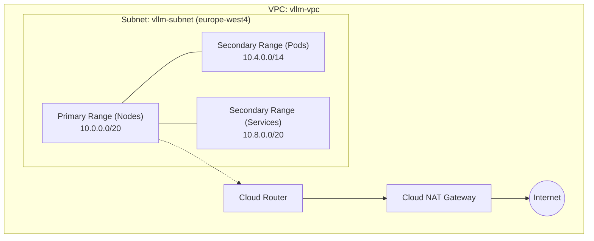

# Network Module

This module provisions a custom VPC and Subnet tailored for a private GKE cluster. It includes a Cloud Router and Cloud NAT to securely route outbound internet traffic from private cluster nodes.

## Resource Inventory
- `google_compute_network.vpc`: The custom VPC network.
- `google_compute_subnetwork.subnet`: The primary subnet with secondary IP ranges for GKE pods and services.
- `google_compute_router.router`: The cloud router required for NAT.
- `google_compute_router_nat.nat`: The Cloud NAT gateway for outbound internet access.

## Architecture

