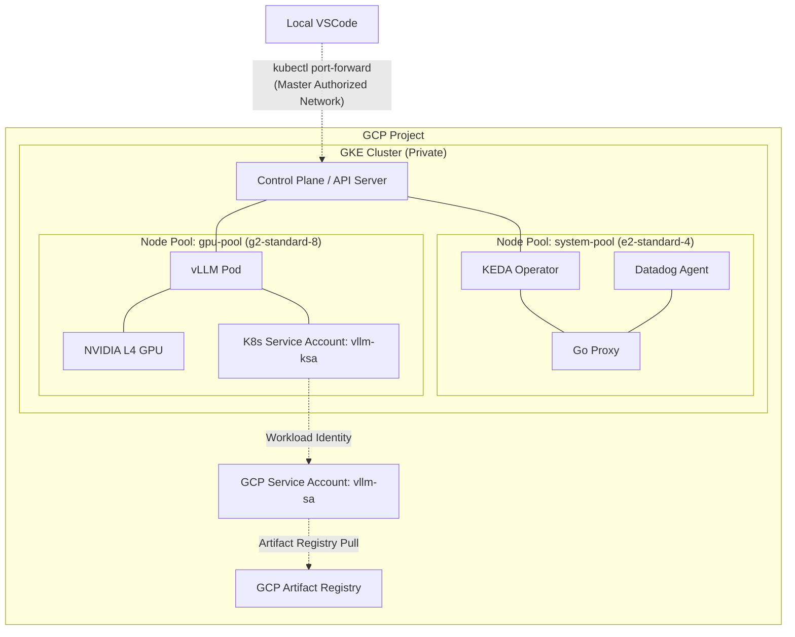

# vLLM Cluster Module

This module provisions a VPC-native private GKE cluster, a dedicated `system-pool` for system workloads (KEDA, Datadog), and an autoscaling `gpu-pool` for running vLLM. It sets up Workload Identity so pods can securely authenticate with Google Cloud services, and grants Artifact Registry access to the node pool service account.

## Resource Inventory
- `google_container_cluster.primary`: The private GKE cluster with Workload Identity enabled.
- `google_container_node_pool.system_pool`: A static `e2-standard-4` node pool that runs 24/7 to host system pods (like the Custom Go Proxy and KEDA).
- `google_container_node_pool.gpu_pool`: The autoscaling `g2-standard-8` node pool with NVIDIA L4 GPUs (configured to scale 0->1).
- `google_service_account.vllm_sa`: The GCP service account for the vLLM workload and cluster nodes.
- `google_service_account_iam_binding.workload_identity_binding`: The IAM binding linking the Kubernetes service account to the GCP service account.
- `google_project_iam_member.artifact_registry_reader`: Grants the node pool service account permission to pull custom proxy images from Google Cloud Artifact Registry.
- `google_project_iam_member.compute_storage_admin`: Grants the Compute Engine default SA permission to use Cloud Build.
- `google_project_iam_member.compute_artifact_writer`: Grants the Compute Engine default SA permission to push images to Artifact Registry.

## Architecture

