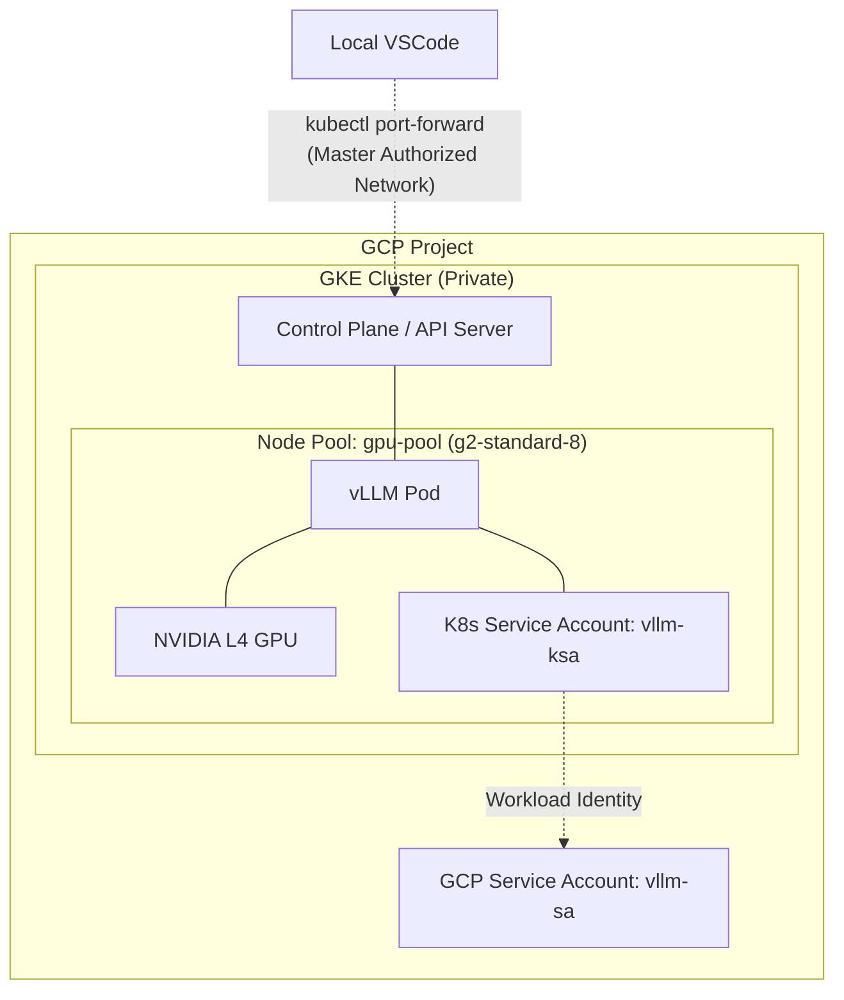

# vLLM Cluster Module

This module provisions a VPC-native private GKE cluster and a dedicated L4 GPU node pool for running vLLM. It sets up Workload Identity so pods can securely authenticate with Google Cloud services.

## Resource Inventory
- `google_container_cluster.primary`: The private GKE cluster with Workload Identity enabled.
- `google_container_node_pool.gpu_pool`: The autoscaling `g2-standard-8` node pool with NVIDIA L4 GPUs (configured as a Zonal pool with max size 1 to respect quota limits).
- `google_service_account.vllm_sa`: The GCP service account for the vLLM workload.
- `google_service_account_iam_binding.workload_identity_binding`: The IAM binding linking the Kubernetes service account to the GCP service account.

## Architecture

