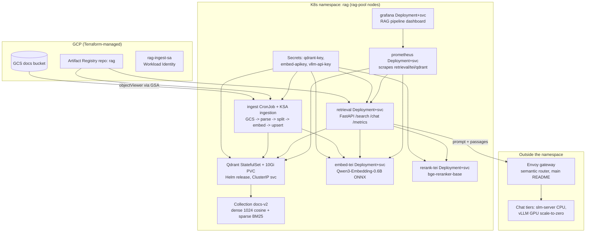

# RAG components

Retrieval-augmented generation on top of the existing vLLM stack. Design and
rationale: `docs/rag-architecture.md`, deep technical reference:
`docs/rag-implementation.md`. All components run in the `rag` namespace on the
dedicated `rag-pool` CPU nodes (`workload=rag` label), ClusterIP only, nothing
touches the GPU pool.

## What this runbook deploys



Deploy order: Qdrant -> collection -> embeddings -> seed corpus -> ingestion
-> retrieval -> observability. `/search` works without the gateway; `/chat`
requires the serving stack (see Prerequisites).

## Prerequisites

1. The cluster itself (`terraform apply` in `infra/environments/dev`), with
   kubectl configured.
2. For `/chat` only: the serving stack from the main `README.md` quickstart
   (KEDA, vLLM chart, `vllm-api-key` secret in the `vllm` namespace, semantic
   routing). Without it `/chat` fails with `NameResolutionError` for the
   gateway host. Note the OCI pull workaround used there:
   `DOCKER_CONFIG=/tmp/empty-docker-config ./install_semantic_routing.sh`.

| Directory | Component | Purpose |
| --- | --- | --- |
| `qdrant/` | Qdrant vector database (Helm) | Stores chunk vectors for the versioned `docs-v2` collection (dense 1024-dim cosine + sparse BM25) |
| `embeddings/` | TEI embedding + reranker servers (ONNX Runtime) | CPU embedding tier (benchmark: `bench/results.md`) and cross-encoder rerank stage |
| `ingest/` | Ingestion CronJob | GCS bucket -> parse (Docling) -> split -> embed -> upsert; idempotent |
| `retrieval/` | Retrieval API (FastAPI) | `/search` over Qdrant, `/chat` end-to-end through the Envoy gateway with citations; OTel GenAI metrics at `/metrics` |
| `observability/` | Prometheus + Grafana | Self-hosted metrics stack for the pipeline (stage latencies, token usage, retrieval scores) |

## Qdrant deployment

Creates: the `rag` namespace, the `qdrant-key` secret, a Helm release
(`qdrant`) with a 1-replica StatefulSet, a 10Gi `standard-rwo` PVC, and a
ClusterIP service on 6333/6334.

```bash
kubectl create namespace rag
kubectl -n rag create secret generic qdrant-key --from-literal=api-key='YOUR_QDRANT_KEY'
```

The secret must be named `qdrant-key`, not `qdrant-apikey`: the chart creates
its own secret under that name when `apiKey` is set, and a pre-existing
unmanaged secret with the same name makes the install fail with an
"invalid ownership metadata" error.

Install via the official Helm chart:

```bash
helm repo add qdrant https://qdrant.github.io/qdrant-helm
helm upgrade --install qdrant qdrant/qdrant -n rag -f k8s/rag/qdrant/values.yaml
```

Validate:

```bash
kubectl -n rag get pods,pvc
kubectl -n rag rollout status statefulset/qdrant

kubectl -n rag port-forward svc/qdrant 6333:6333 &
export QDRANT_KEY=$(kubectl -n rag get secret qdrant-key -o jsonpath='{.data.api-key}' | base64 -d)
curl -H "api-key: $QDRANT_KEY" localhost:6333/collections   # expect empty list
curl localhost:6333/readyz                                  # expect ok
```

Create the versioned collection (embedding model is locked to it — changing
the model means a new collection and a full re-embed). `docs-v2` adds a sparse
BM25 vector for hybrid search (dense + sparse, RRF fusion server-side):

```bash
curl -X PUT -H "api-key: $QDRANT_KEY" -H 'Content-Type: application/json' \
  localhost:6333/collections/docs-v2 \
  -d '{"vectors": {"dense": {"size": 1024, "distance": "Cosine"}}, "sparse_vectors": {"bm25": {"modifier": "idf"}}}'
```

## Embedding server

Creates: the `embed-apikey` secret, two Deployments + ClusterIP services:
`embed-tei` (dense vectors, TEI serving the ONNX export of
Qwen3-Embedding-0.6B; benchmark and tuning history in `bench/results.md`) and
`rerank-tei` (cross-encoder reranker, `Xenova/bge-reranker-base`).

```bash
kubectl -n rag create secret generic embed-apikey --from-literal=api-key='YOUR_EMBED_KEY'
kubectl apply -f k8s/rag/embeddings/tei-deployment.yaml
kubectl apply -f k8s/rag/embeddings/reranker-deployment.yaml
kubectl -n rag rollout status deployment/embed-tei     # first start downloads ~1.2GB of weights
kubectl -n rag rollout status deployment/rerank-tei
```

Both are required: the retrieval deployment references `rerank-tei` for its
reranking stage and fails with `NameResolutionError` if it is absent (or run
hybrid-only by removing the env var:
`kubectl -n rag set env deployment/retrieval RERANK_URL-`).

## Seed corpus

Creates: objects under `gs://<bucket>/seed/` read by the ingestion job. Upload
this repository's docs preserving repo-relative paths (the golden eval set's
`expected_source` values match those paths):

```bash
for f in README.md agent.md docs/*.md k8s/vllm/README.md k8s/vllm-chart/README.md \
         infra/modules/network/README.md infra/modules/vllm-cluster/README.md; do
  gcloud storage cp "$f" "gs://$BUCKET/seed/$f"
done
gcloud storage ls "gs://$BUCKET/seed/**" | wc -l   # expect 12
```

## Ingestion job

Creates: an Artifact Registry docker repo `rag` (once), the `ingest` image,
the `ingestion` Kubernetes service account (Workload Identity bound to
`rag-ingest-sa` by Terraform), and a daily CronJob.

Build and push the image, then apply the CronJob with the project-specific
values substituted. Export your project ID once and copy-paste the rest:

```bash
export PROJECT_ID=YOUR_PROJECT_ID
export BUCKET=vllm-gke-rag-docs-${PROJECT_ID}

gcloud artifacts repositories create rag --repository-format=docker \
  --location=us-central1 --project=$PROJECT_ID
gcloud builds submit ingest --tag us-central1-docker.pkg.dev/$PROJECT_ID/rag/ingest:latest

# substitute placeholders and apply (GSA email, image path, bucket, GCS prefix)
sed -e "s/YOUR_PROJECT_ID/$PROJECT_ID/g" \
    -e "s/YOUR_RAG_DOCS_BUCKET/$BUCKET/" \
    -e 's/value: ""/value: "seed\/"/' \
    k8s/rag/ingest/cronjob.yaml | kubectl apply -f -
```

The `sed` pattern is `s/PLACEHOLDER/REAL_VALUE/`: the left side is the literal
text in the file (`YOUR_PROJECT_ID`), the right side is your value. Applying
the file without the substitution fails with `InvalidImageName` (the
`YOUR_PROJECT_ID` placeholder contains underscores, which are not valid in an
image path). Artifact Registry locations are regions (`us-central1`), not
zones (`us-central1-a`).

Manual runs go through the CronJob (idempotent, safe to re-run):

```bash
kubectl -n rag create job ingest-manual-1 --from=cronjob/ingest
kubectl -n rag logs -f job/ingest-manual-1
# expect: INFO done: 12 files, ~100 chunks, ~100 upserts, 0 errors
```

`done: 0 files` means the bucket/prefix is empty — re-check the seed upload.
Run ingestion only after `embed-tei` is Ready.

## Retrieval API

Creates: the `retrieval` Deployment + ClusterIP service (8090). `/search` is
self-contained; `/chat` additionally calls the gateway, so it also needs the
serving stack (Prerequisites) and two environment-specific values:

1. `GATEWAY_URL` must point at the gateway data-plane service, whose name
   carries an install-specific suffix. Find it with:
   `kubectl get svc -n envoy-gateway-system --selector=gateway.envoyproxy.io/owning-gateway-name=semantic-router`
2. The gateway Bearer key must also exist in the `rag` namespace. Mirror it
   (and re-mirror after any reinstall of the serving stack, which rotates the
   value):
   ```bash
   KEY=$(kubectl -n vllm get secret vllm-api-key -o jsonpath='{.data.api-key}' | base64 -d)
   kubectl -n rag create secret generic vllm-api-key --from-literal=api-key="$KEY"
   ```

Then:

```bash
gcloud builds submit retrieval --tag us-central1-docker.pkg.dev/$PROJECT_ID/rag/retrieval:latest
sed "s/YOUR_PROJECT_ID/$PROJECT_ID/g" k8s/rag/retrieval/deployment.yaml | kubectl apply -f -
kubectl -n rag port-forward svc/retrieval 8090:8090 &
curl localhost:8090/search -H 'Content-Type: application/json' \
  -d '{"query":"how does KEDA wake the GPU pool?"}'
```

## Observability

Creates: the `prometheus` Deployment + service (scrapes retrieval, both TEI
servers and Qdrant) and the `grafana` Deployment + service with a provisioned
Prometheus datasource and the "RAG pipeline" dashboard (stage latencies,
request rates, token usage, top-score distribution).

The retrieval API emits OpenTelemetry metrics (GenAI semantic conventions:
`gen_ai.client.operation.duration`, `gen_ai.client.token.usage`, plus
`rag.retrieval.*` stage histograms) at `/metrics`:

```bash
kubectl apply -f k8s/rag/observability/prometheus.yaml -f k8s/rag/observability/grafana.yaml
kubectl -n rag port-forward svc/grafana 3000:3000   # http://localhost:3000 -> "RAG pipeline"
```

The stage-latency and token-usage panels populate only after traffic: the
token panel needs a `/chat` call; histograms need a few `/search` calls.
Metric names carry the OTel unit suffix (e.g.
`rag_retrieval_stage_duration_seconds_bucket`).

Note: Google Managed Prometheus was evaluated first and abandoned for now —
scraping worked but no metrics (including native GKE system metrics) reached
Cloud Monitoring even after granting the node SA `monitoring.metricWriter`.
The self-hosted stack is deterministic and has no IAM surface. Revisit GMP as
a platform issue separately.
