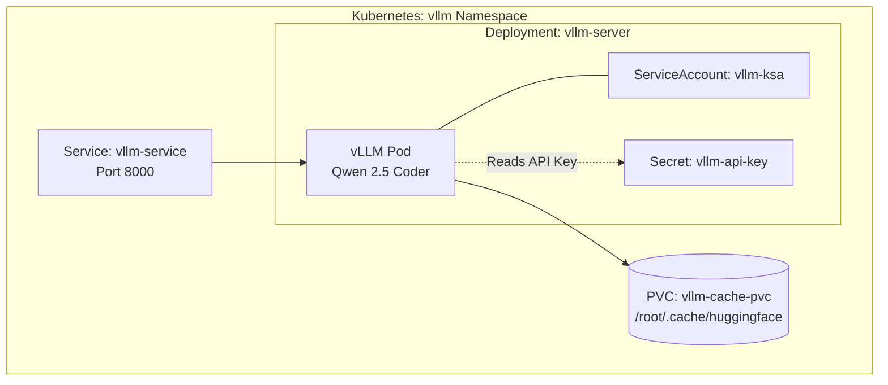

# vLLM Kubernetes Manifests

Deploys the vLLM OpenAI-compatible server configured for Qwen 2.5 Coder on GKE. It utilizes Workload Identity and a PVC to cache model weights across Spot instances.

## Resource Inventory
- `Namespace`: `vllm`
- `ServiceAccount`: `vllm-ksa` (Linked to GCP Workload Identity)
- `PersistentVolumeClaim`: `vllm-cache-pvc` (50Gi for HuggingFace caching)
- `Deployment`: `vllm-server` (Runs vLLM, requests 1 L4 GPU)
- `Service`: `vllm-service` (ClusterIP exposing port 8000)

## Architecture

