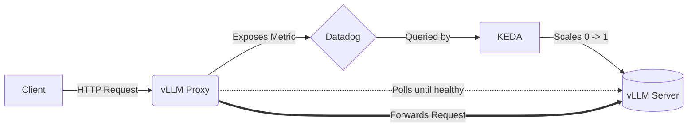

# vLLM Custom Reverse Proxy

This folder contains the source code for a lightweight Go reverse proxy designed to enable **Scale-to-Zero** for synchronous HTTP clients.

## The Problem
Synchronous AI clients (like IDE code-assist extensions) expect an HTTP connection to remain open until a response is streamed back. Traditional scale-to-zero queueing systems (like Redis + KEDA) fail because they are asynchronous—they acknowledge the request and drop the HTTP connection immediately.

## The Solution
This Go proxy sits between the client and the vLLM server.
1. When it receives an HTTP request, it increments a Prometheus gauge (`vllm_proxy_active_requests`).
2. Datadog scrapes this metric, and KEDA uses it to scale vLLM from `0` to `1`.
3. The Proxy loops and polls the vLLM backend's `/health` endpoint every 5 seconds.
4. **Crucially, it holds the client's HTTP connection open** during the 3-4 minute cold-start period.
5. Once vLLM is healthy, it reverse-proxies the traffic.

## Architecture



## Build & Push
To rebuild the image and push it to Google Cloud Artifact Registry, run:
```bash
./build.sh
```
*Note: This script requires `gcloud` to be authenticated, and your service account must have `roles/storage.admin` and `roles/artifactregistry.writer` permissions.*
